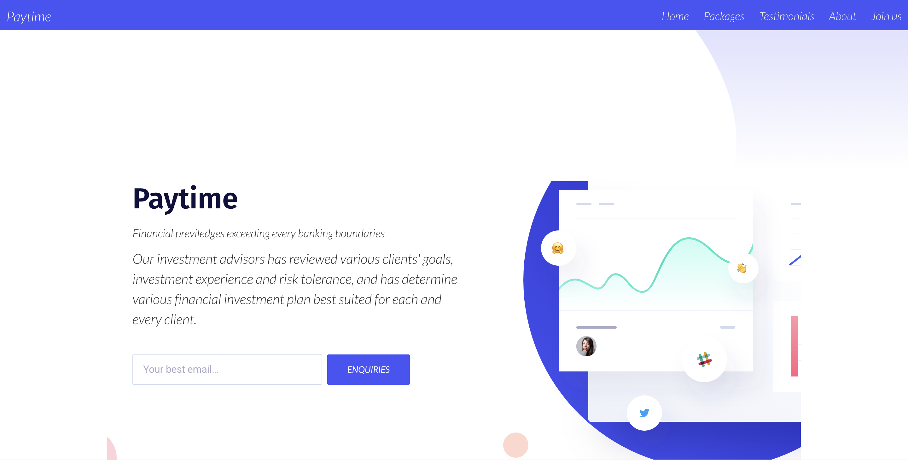

Live demo:
https://pay-time.herokuapp.com/

# Paytime - The best investment institution in Nigeria

## Welcome! 👋

Thanks for checking out this application.

## Running this application
1. Clone the repository
2. Cd into paytime
3. pip install -r requirements.txt
4. update your .env
5. python manage.py collectstatic
6. python manage.py runserver
7. open two terminals and run 8, 9
8. celery -A paytime worker -l debug (to run Celery)
9. celery -A paytime beat -l INFO --scheduler django_celery_beat.schedulers:DatabaseScheduler

## Giving feedback

Feedback is always welcome, so if you have any to give on this challenge please email onengiye.richard@gmail.com

**Have fun building!** 🚀

## Techonologies used
1. Python
2. Django
3. Celery
4. Redis

## Contributors
1. Onengiye Richard

